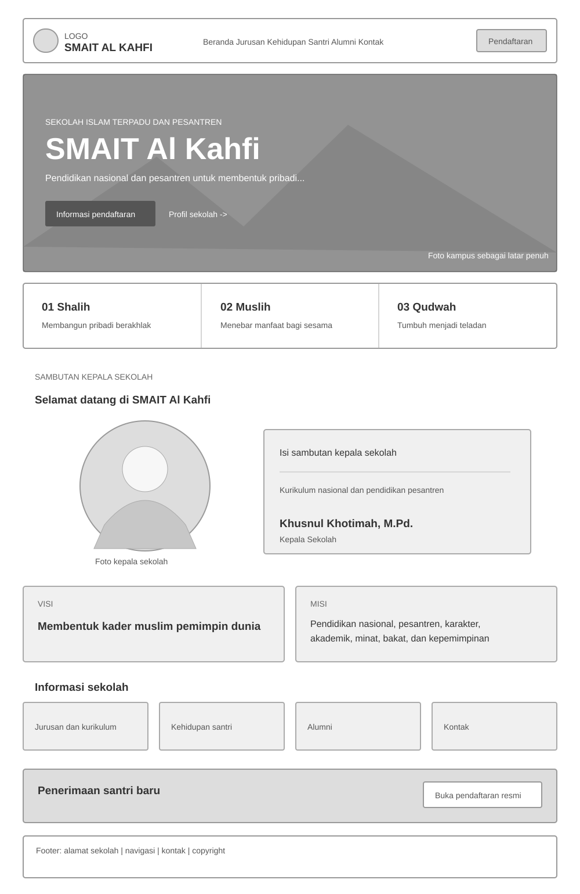
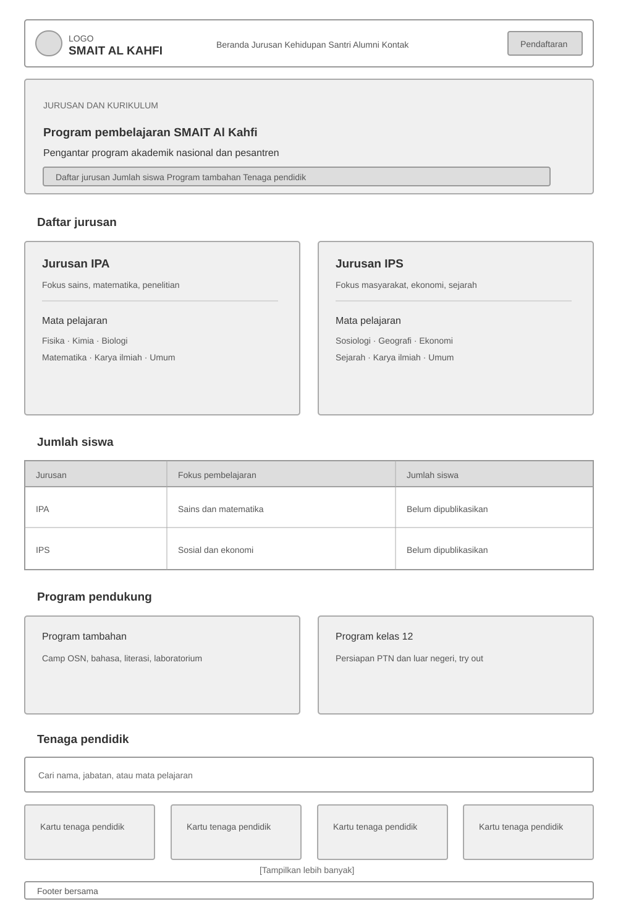
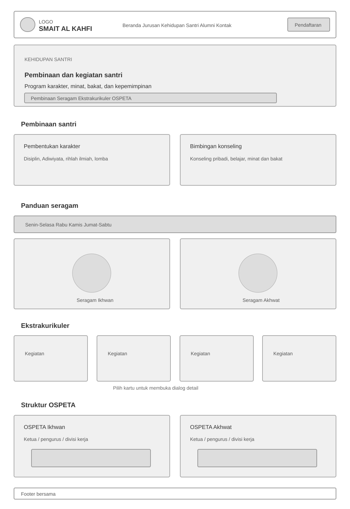
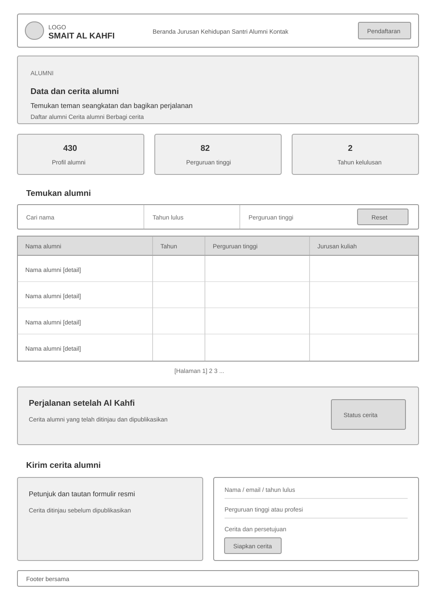
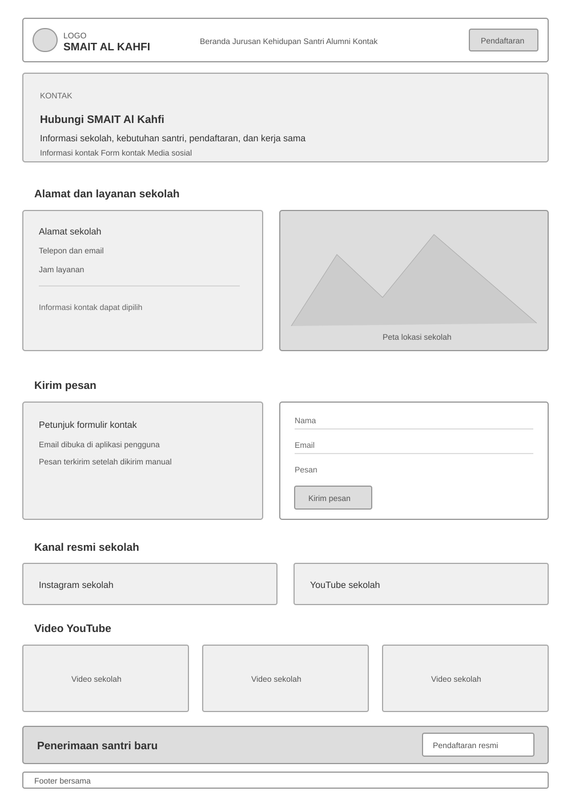

# Tugas 2: Website Sekolah

**Nama: Khalisya Zahra Putria Rahman**

**NRP: 5025251045**

**Kelas: Pemrograman Web B**

## Fitur dan Halaman

Website ini terdiri atas beberapa halaman yang saling terhubung dan memiliki navigasi utama responsif. Setiap bagian dalam halaman HTML disusun dengan jelas dan diberi komentar.

### 1. Beranda [`index.html`](index.html)
Halaman utama yang memberikan gambaran umum tentang sekolah.
- **Hero Beranda**: Menampilkan banner utama, motto, dan ajakan untuk bertindak.
- **Nilai**: Memperkenalkan nilai-nilai utama (*Shalih*, *Muslih*, *Qudwah*).
- **Profil Sekolah**: Sambutan dari kepala sekolah.
- **Visi dan Misi**: Penjelasan mengenai visi dan misi sekolah.
- **Informasi Sekolah**: Tautan cepat ke halaman Jurusan, Kehidupan Santri, Alumni, dan Kontak.
- **Pendaftaran**: Tautan menuju situs resmi pendaftaran.

### 2. Jurusan dan Kurikulum [`kurikulum.html`](kurikulum.html)
- **Hero Jurusan**: Pengantar program akademik.
- **Daftar Jurusan**: Menjelaskan fokus akademik jurusan IPA dan IPS beserta daftar mata pelajarannya.
- **Jumlah Siswa**: Tabel yang menampilkan jumlah siswa pada setiap jurusan.
- **Program Pendukung**: Penjelasan tentang program tambahan dan program khusus untuk siswa kelas 12.
- **Tenaga Pendidik**: Daftar guru yang dilengkapi fitur pencarian interaktif menggunakan JavaScript.

### 3. Kehidupan Santri [`kesiswaan.html`](kesiswaan.html)
- **Hero Kehidupan Santri**: Pengantar program kesiswaan.
- **Pembinaan**: Penjelasan tentang pembentukan karakter dan layanan bimbingan konseling.
- **Seragam**: Panduan visual seragam interaktif yang dikelompokkan berdasarkan hari menggunakan tab JavaScript.
- **Ekstrakurikuler**: Daftar kegiatan ekstrakurikuler interaktif; detail ditampilkan dalam modal (kotak dialog) saat dipilih.
- **OSPETA**: Struktur organisasi santri OSPETA Ikhwan dan Akhwat, termasuk bidang kerja masing-masing.

### 4. Alumni [`alumni.html`](alumni.html)
- **Hero Alumni**: Pengantar fitur pencarian data alumni.
- **Data Alumni**: Tabel pencarian data alumni yang terintegrasi dengan JavaScript, sehingga data dapat dicari berdasarkan nama, tahun kelulusan, dan perguruan tinggi, serta ditampilkan dengan paginasi.
- **Cerita Alumni**: Bagian untuk menampilkan cerita alumni.
- **Berbagi Cerita**: Formulir untuk membagikan cerita alumni.

### 5. Kontak [`kontak.html`](kontak.html)
- **Hero Kontak**: Pengantar halaman kontak.
- **Informasi Kontak**: Alamat lengkap, nomor telepon, email, jam layanan, dan peta lokasi melalui iframe Google Maps.
- **Formulir Kontak**: Formulir pesan yang terhubung dengan layanan email dan membuka aplikasi email pengguna dengan data yang telah diisi.
- **Media Sosial**: Kanal media sosial resmi dan galeri video YouTube sekolah.

## Wireframe

Wireframe visual berikut menunjukkan susunan utama setiap halaman pada desktop. Pada layar seluler, navigasi utama berubah menjadi menu; kolom dan kelompok kartu ditampilkan bertumpuk.

### 1. Beranda



### 2. Jurusan dan Kurikulum



### 3. Kehidupan Santri



### 4. Alumni



### 5. Kontak



## Arsitektur Informasi

```text
Website SMAIT Al Kahfi
|
+-- Header dan navigasi bersama
|   +-- Beranda
|   +-- Jurusan
|   +-- Kehidupan Santri
|   +-- Alumni
|   +-- Kontak
|   +-- Pendaftaran (situs PSB eksternal)
|
+-- Beranda (index.html)
|   +-- Hero dan nilai sekolah
|   +-- Sambutan kepala sekolah
|   +-- Visi dan misi
|   +-- Tautan informasi sekolah
|   +-- Pendaftaran santri baru
|
+-- Jurusan dan Kurikulum (kurikulum.html)
|   +-- Jurusan IPA dan IPS
|   +-- Jumlah siswa
|   +-- Program pendukung
|   +-- Tenaga pendidik (pencarian)
|
+-- Kehidupan Santri (kesiswaan.html)
|   +-- Pembinaan dan konseling
|   +-- Panduan seragam (tab hari)
|   +-- Ekstrakurikuler (dialog detail)
|   +-- Struktur OSPETA
|
+-- Alumni (alumni.html)
|   +-- Direktori (pencarian, filter, paginasi)
|   +-- Detail profil (dialog)
|   +-- Cerita alumni
|   +-- Form cerita -> formulir resmi eksternal
|
+-- Kontak (kontak.html)
|   +-- Informasi kontak dan peta
|   +-- Form kontak -> aplikasi email pengguna
|   +-- Media sosial dan video YouTube
|   +-- Pendaftaran santri baru
|
+-- Footer bersama
	+-- Alamat dan identitas sekolah
	+-- Tautan halaman
	+-- Telepon dan email
```

## Struktur Kode (CSS dan JavaScript)

### JavaScript (`assets/app.js`)
Situs ini menggunakan interaksi DOM yang ringan tanpa memerlukan framework tambahan:
- **Menu Seluler (`setMenu`)**: Membuka dan menutup navigasi pada perangkat dengan layar kecil.
- **Modal / Dialog (`openDialog`)**: Menampilkan dialog interaktif untuk detail seragam, informasi ekstrakurikuler, profil alumni, dan pratinjau cerita alumni.
- **Antarmuka Tab**: Sistem tab interaktif untuk menampilkan detail seragam (Senin–Selasa, Rabu, Kamis, dan seterusnya).
- **Pencarian Langsung dan Paginasi**: Fitur pencarian tenaga pendidik (`teacher-search`) dan data alumni (`alumni-search`), dilengkapi filter dan paginasi. Data bersumber dari `assets/data/content.js`.
- **Penanganan Formulir**: Menangani peristiwa pengiriman pada `contact-form` dan `alumni-story-form` untuk menyiapkan pesan melalui `mailto:` atau menampilkan dialog pratinjau.
- **Animasi Saat Gulir (`IntersectionObserver`)**: Menampilkan elemen dengan animasi halus saat elemen masuk ke area pandang.

### CSS (`assets/style.css`)
- **Desain Responsif**: Menggunakan media query untuk menyesuaikan tata letak pada perangkat seluler, tablet, dan desktop.
- **Variabel CSS**: Mendefinisikan token warna (warna utama tema `#1d503b`), tipografi (font Outfit), jarak, dan animasi agar tampilan konsisten di seluruh situs.
- **Komponen UI**: Mengatur tampilan navigasi, tombol, kartu, tabel, formulir, tab, dialog (modal), dan komponen utilitas lainnya.
- **Animasi dan Transisi**: Mengatur efek `hover`, transisi `opacity` dan `transform` untuk animasi saat gulir, serta interaksi modal.

## Preview

https://schoolweb-pweb.vercel.app/.
