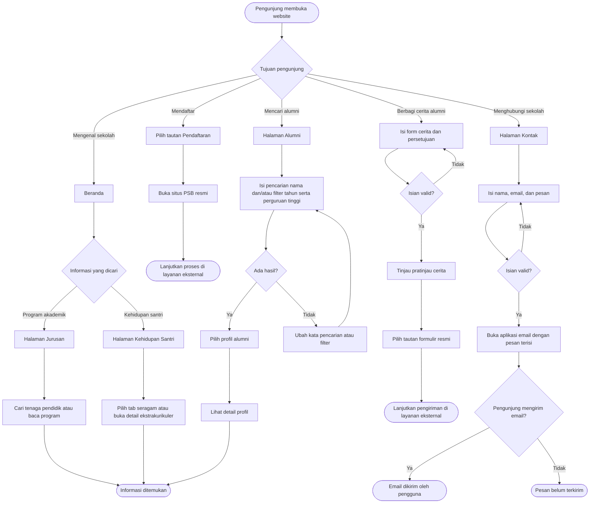

# Tugas 3: Website Product Requirements Document (PRD)

**Nama: Khalisya Zahra Putria Rahman**

**NRP: 5025251045**

**Kelas: Pemrograman Web B**

## Website SMAIT Al Kahfi

| Informasi | Detail |
|---|---|
| Status dokumen | As-built: mendokumentasikan website Tugas-2 yang telah dibuat |
| Produk | Website informasi publik SMAIT Al Kahfi |
| Platform | Website responsif, dapat diakses melalui browser desktop maupun perangkat seluler |
| Sumber spesifikasi | Implementasi pada folder `Tugas-2` |

## 1. Ringkasan Produk

Website SMAIT Al Kahfi menyediakan informasi sekolah, program akademik, kegiatan santri, alumni, dan kontak dalam satu situs publik. Pengunjung dapat menelusuri lima halaman utama, menggunakan interaksi pencarian dan filter pada data, melihat informasi melalui dialog, serta mengikuti tautan ke kanal dan layanan resmi sekolah.

Website ini merupakan situs informasi statis dengan interaksi sisi-klien. Situs tidak menyediakan akun pengguna, panel administrasi, basis data dinamis, maupun layanan backend untuk menyimpan formulir.

## 2. Latar Belakang dan Masalah

Informasi sekolah tersebar pada beberapa topik yang dibutuhkan oleh calon siswa dan keluarga, siswa, alumni, serta masyarakat. Website ini menyatukan informasi tersebut dan menyediakan navigasi yang konsisten agar pengunjung dapat menemukan informasi akademik, kehidupan santri, data alumni, dan cara menghubungi sekolah.

## 3. Tujuan Produk

- Menyajikan profil, visi, misi, dan nilai SMAIT Al Kahfi.
- Menyediakan informasi jurusan, mata pelajaran, program pendukung, dan tenaga pendidik.
- Menjelaskan pembinaan, panduan seragam, ekstrakurikuler, dan organisasi santri.
- Membantu pengunjung mencari informasi alumni berdasarkan nama, tahun kelulusan, dan perguruan tinggi.
- Menyediakan informasi kontak, lokasi, media sosial, serta tautan ke layanan pendaftaran resmi.

## 4. Pengguna Utama

| Pengguna | Kebutuhan |
|---|---|
| Calon siswa dan orang tua/wali | Memahami profil sekolah, program akademik, kehidupan santri, dan memperoleh tautan pendaftaran resmi. |
| Siswa dan keluarga | Melihat informasi kegiatan, pembinaan, panduan seragam, dan ekstrakurikuler. |
| Alumni | Menemukan data alumni dan menyiapkan cerita untuk ditinjau melalui kanal resmi. |
| Masyarakat dan mitra | Menemukan alamat, kontak, kanal media sosial, dan informasi umum sekolah. |

## 5. Ruang Lingkup

### Termasuk

- Lima halaman informasi: Beranda, Jurusan, Kehidupan Santri, Alumni, dan Kontak.
- Navigasi desktop dan menu seluler.
- Pencarian tenaga pendidik serta pencarian, filter, dan paginasi data alumni.
- Tab panduan seragam dan dialog untuk detail gambar, ekstrakurikuler, serta profil alumni.
- Form kontak yang menyiapkan pesan pada aplikasi email pengguna.
- Form cerita alumni yang menampilkan pratinjau dan tautan menuju formulir resmi sekolah.
- Tautan eksternal ke pendaftaran, media sosial, YouTube, peta, dan formulir resmi.

### Tidak termasuk

- Proses pendaftaran siswa baru; pendaftaran dilakukan pada layanan eksternal.
- Pengiriman atau penyimpanan pesan dan cerita alumni melalui backend website ini.
- Login, pengelolaan akun, panel administrasi, dan pembaruan konten melalui CMS.
- Pengelolaan data alumni atau tenaga pendidik secara langsung oleh pengunjung.
- Data jumlah siswa per jurusan; halaman menyatakan data tersebut belum dipublikasikan.

### Struktur Website

Semua halaman berbagi header dengan navigasi utama, tautan pendaftaran, menu seluler, serta footer berisi informasi sekolah dan kontak.

- **Beranda** (`index.html`)
	- Hero sekolah dan ajakan melihat informasi pendaftaran.
	- Nilai sekolah: Shalih, Muslih, dan Qudwah.
	- Profil sekolah, visi dan misi.
	- Tautan menuju Jurusan, Kehidupan Santri, Alumni, dan Kontak.
	- Informasi pendaftaran siswa baru.
- **Jurusan** (`kurikulum.html`)
	- Program IPA dan IPS beserta mata pelajaran.
	- Tabel jumlah siswa per jurusan.
	- Program tambahan dan program kelas 12.
	- Daftar tenaga pendidik dengan pencarian.
- **Kehidupan Santri** (`kesiswaan.html`)
	- Pembinaan karakter dan bimbingan konseling.
	- Panduan seragam berdasarkan hari untuk Ikhwan dan Akhwat.
	- Ekstrakurikuler dengan dialog detail.
	- Struktur organisasi OSPETA Ikhwan dan Akhwat.
- **Alumni** (`alumni.html`)
	- Ringkasan data dan direktori alumni.
	- Pencarian berdasarkan nama, tahun kelulusan, dan perguruan tinggi, dengan paginasi.
	- Bagian cerita alumni dan form untuk menyiapkan cerita.
- **Kontak** (`kontak.html`)
	- Alamat, telepon, email, jam layanan, dan peta.
	- Form kontak yang menyiapkan email melalui aplikasi email pengguna.
	- Media sosial, video YouTube, dan tautan pendaftaran resmi.
- **Layanan eksternal**
	- Pendaftaran siswa baru dibuka di situs resmi PSB.
	- Pengiriman cerita alumni dilanjutkan melalui formulir resmi sekolah.

### User Flow Utama

Diagram berikut menggambarkan alur pengunjung berdasarkan tujuan. Proses yang berpindah ke layanan eksternal berada di luar kendali website ini.

**Batas alur:** Website hanya menyiapkan email kontak; pengguna masih perlu mengirimkannya dari aplikasi email. Form cerita menampilkan pratinjau sebelum pengunjung berpindah ke formulir resmi. Website tidak menerima konfirmasi pengiriman atau menyimpan data tersebut.

## 6. Kebutuhan Fungsional dan Kriteria Penerimaan

### 6.1 Navigasi dan Beranda

- **FR-01:** Website menyediakan navigasi ke Beranda, Jurusan, Kehidupan Santri, Alumni, dan Kontak pada setiap halaman.
- **FR-02:** Pada layar seluler, tombol menu membuka dan menutup navigasi; tautan navigasi menutup menu setelah dipilih. Tombol `Escape` juga menutup menu.
- **FR-03:** Beranda menampilkan identitas sekolah, motto, profil, visi dan misi, tautan informasi utama, serta ajakan menuju situs pendaftaran resmi.
- **Kriteria penerimaan:** Pengunjung dapat berpindah ke kelima halaman dari navigasi. Tautan pendaftaran mengarah ke layanan eksternal, bukan formulir pendaftaran internal.

### 6.2 Jurusan dan Kurikulum

- **FR-04:** Halaman Jurusan menampilkan fokus dan mata pelajaran jurusan IPA dan IPS.
- **FR-05:** Halaman menyediakan tabel jumlah siswa per jurusan, program tambahan, program kelas 12, serta daftar tenaga pendidik.
- **FR-06:** Pengunjung dapat mencari tenaga pendidik berdasarkan nama, jabatan, atau mata pelajaran. Hasil ditampilkan bertahap, delapan data per tampilan, dengan tombol untuk melihat lebih banyak.
- **Kriteria penerimaan:** Pencarian memperbarui hasil saat pengguna mengetik; jika tidak ada hasil yang cocok, halaman menampilkan pesan yang sesuai. Jumlah siswa yang belum dipublikasikan ditandai demikian dan tidak direkayasa.

### 6.3 Kehidupan Santri

- **FR-07:** Halaman menampilkan informasi pembinaan karakter, bimbingan konseling, ekstrakurikuler, dan struktur OSPETA.
- **FR-08:** Pengunjung dapat memilih tab hari untuk melihat panduan seragam Ikhwan dan Akhwat; gambar seragam dapat diperbesar melalui dialog.
- **FR-09:** Pengunjung dapat membuka dialog detail ekstrakurikuler.
- **Kriteria penerimaan:** Memilih tab menampilkan panel hari yang sesuai. Dialog dapat ditutup dan mengembalikan fokus ke elemen pembukanya.

### 6.4 Alumni

- **FR-10:** Halaman menampilkan ringkasan jumlah profil, perguruan tinggi, dan tahun kelulusan, serta tabel profil alumni.
- **FR-11:** Pengunjung dapat menyaring data berdasarkan nama, tahun lulus, dan perguruan tinggi, mereset filter, serta berpindah halaman hasil.
- **FR-12:** Memilih nama alumni membuka dialog detail profil yang tersedia.
- **FR-13:** Pengunjung dapat mengisi form cerita alumni. Setelah validasi, situs menampilkan pratinjau dan tautan ke formulir resmi sekolah.
- **Kriteria penerimaan:** Perubahan pencarian/filter memperbarui jumlah dan daftar hasil serta mengembalikan paginasi ke halaman pertama. Reset mengosongkan semua filter. Form cerita tidak mengklaim cerita telah terkirim atau dipublikasikan.
- **Kondisi konten saat ini:** Bagian cerita alumni menyatakan belum ada cerita yang ditinjau dan dipublikasikan.

### 6.5 Kontak dan Informasi Resmi

- **FR-14:** Halaman Kontak menampilkan alamat, telepon, email, jam layanan, peta, media sosial, dan pilihan video YouTube.
- **FR-15:** Form kontak memvalidasi nama, email, dan pesan sebelum menyiapkan email ke alamat sekolah melalui aplikasi email pengguna.
- **FR-16:** Website menyediakan tautan ke situs pendaftaran resmi.
- **Kriteria penerimaan:** Form tidak menampilkan status berhasil terkirim; pengguna diberi tahu bahwa pesan hanya terkirim setelah email benar-benar dikirim dari aplikasi email. Tautan eksternal membuka tujuan resminya.

## 7. Kebutuhan Nonfungsional

- **NFR-01 Responsif:** Tata letak dan navigasi menyesuaikan layar desktop, tablet, dan seluler.
- **NFR-02 Aksesibilitas dasar:** Halaman menggunakan struktur semantik, label formulir, teks alternatif gambar, status fokus/terpilih pada kontrol interaktif, dan tautan lewati ke konten.
- **NFR-03 Interaksi papan ketik:** Menu dapat ditutup dengan `Escape`; tab seragam mendukung tombol panah; dialog mengelola fokus saat dibuka dan ditutup.
- **NFR-04 Gerakan:** Animasi reveal tidak dijalankan jika preferensi perangkat `prefers-reduced-motion` aktif.
- **NFR-05 Keamanan tampilan data:** Nilai dinamis yang ditampilkan di dialog dan hasil data di-escape sebelum dimasukkan sebagai HTML.
- **NFR-06 Ketergantungan:** Fitur utama berjalan menggunakan HTML, CSS, dan JavaScript sisi-klien tanpa framework atau backend tambahan; peta, pendaftaran, media, dan formulir resmi bergantung pada layanan eksternal.

## 8. Data dan Batasan

- Data tenaga pendidik dan alumni disediakan dalam berkas JavaScript statis dan tidak diperbarui secara real-time.
- Pencarian, filter, dan paginasi alumni hanya bekerja pada data yang tersedia di browser.
- Informasi jumlah alumni, perguruan tinggi, tahun kelulusan, dan data lain mengikuti konten yang ditampilkan website; pembaruan dan kebenaran data berada di luar kemampuan situs statis ini.
- Form kontak bergantung pada aplikasi email yang terpasang atau terkonfigurasi di perangkat pengunjung.
- Pengiriman cerita alumni, publikasi cerita, dan pendaftaran dilakukan pada layanan resmi eksternal.
- Konten panduan seragam menyebut tahun ajaran 2026/2027; data sekolah dapat berubah dan perlu diperbarui oleh pengelola konten situs.

## 9. Indikator Keberhasilan

Keberhasilan versi as-built dinilai berdasarkan perilaku yang dapat diverifikasi berikut:

- Pengunjung dapat mencapai semua halaman utama melalui navigasi desktop maupun seluler.
- Informasi jurusan, kegiatan santri, alumni, dan kontak dapat ditemukan pada halaman yang sesuai.
- Pencarian guru serta pencarian/filter/paginasi alumni menghasilkan daftar dan status kosong yang sesuai dengan data statis.
- Interaksi tab dan dialog dapat digunakan dengan mouse maupun papan ketik.
- Form kontak dan cerita alumni menjelaskan langkah lanjutan dengan benar tanpa memberi kesan bahwa data telah dikirim atau disimpan oleh website.

Analitik trafik, konversi pendaftaran, dan pengiriman form tidak tersedia di dalam implementasi ini sehingga tidak ditetapkan sebagai metrik terukur.

## 10. Referensi Implementasi

- [README Tugas-2](../Tugas-2/README.md)
- [Link Website](https://schoolweb-pweb.vercel.app/)
