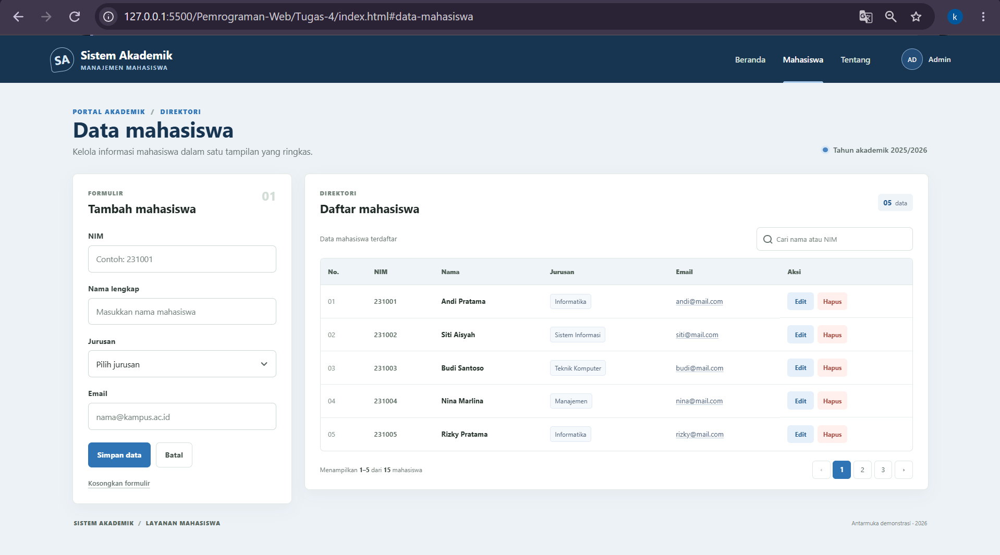

# Tugas 4: Front-end CSS Form

**Nama: Khalisya Zahra Putria Rahman**

**NRP: 5025251045**

**Kelas: Pemrograman Web B**

## Layout

Halaman ini menampilkan formulir input mahasiswa dan tabel direktori dalam satu dashboard akademik yang responsif. Tampilannya terinspirasi dari referensi tugas, dengan penyesuaian warna dan tata letak.



## Isi Halaman

- Formulir dengan kolom NIM, nama lengkap, jurusan, dan email.
- Tabel contoh berisi data mahasiswa, termasuk label jurusan dan aksi edit/hapus.
- Kolom pencarian dan kontrol pagination sebagai elemen antarmuka.
- Navigasi, status tahun akademik, dan informasi jumlah data.
- Tata letak responsif untuk desktop, tablet, dan layar ponsel.

## File

- [`index.html`](index.html)
- [`style.css`](style.css)

## Struktur Repo

```text
Tugas-4/
├── dokumentasi.png
├── index.html
├── style.css
└── README.md
```
